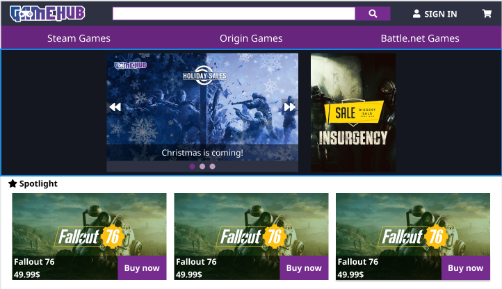
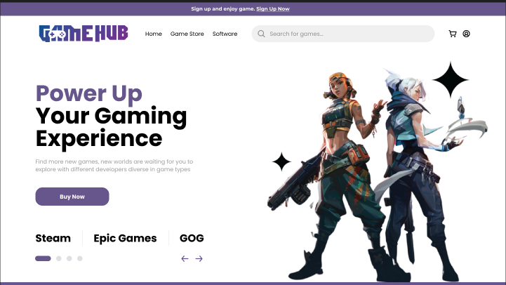

# :star2:Gamehub Remake:star2:

Với mong muốn ôn lại kỹ niệm thời đại học về môn lập trình web. Tôi quyết định khởi động lại **GameHub Project** với tiêu chí cải thiện giao diện và chức năng. Với lần làm lại này tôi sẽ đem đến một giao diện mới

#### Giao diện cũ :point_right:

#### Giao diện mới :point_right:

## Chủ đề :bell:

Chủ đề : **Website bán trò chơi điện tử**. :video_game:

Cải tiến giao diện và làm mới một số chức năng :confetti_ball:

## Công nghệ được sử dụng :floppy_disk:

- :+1: Sử dụng các ngôn ngữ lập trình web cơ bản như **_HTML_**, **_CSS_** và **_Javascript_**.
- :satisfied: Sử dụng ngôn ngữ mới **_SCSS_**, nhằm sắp xếp ngôn ngữ của CSS một cách dễ dàng và gọn gàng hơn. Giúp quản lý tốt các file.

## Công việc chính :globe_with_meridians:

Về **Front-end** :arrow_forward::

- [ ] Thiết kế trang sản phẩm
- [ ] Thiết kế trang chủ
- [ ] Thiết kế trang kết quả tìm kiếm
- [ ] Thiết kế trang hiện sản phẩm theo mục lục (catalog)
- [ ] Thiết kế trang giỏ hàng
- [ ] Thiết kế các trang thanh toán (gồm trang chọn phương thức thanh toán, hoàn tất thanh toán)
- [ ] Thiết kế trang đăng ký
- [ ] Thiết kế trang đăng nhập
- [ ] Thiết kế trang hồ sơ người dùng
- [ ] Thiết kế trang xem đơn hàng
- [ ] Thiết kế trang người bán (sản phẩm, người dùng, hóa đơn, thống kê, tổng quan)

Về **Back-end** :fast_forward::

## Kết nối Front-end và Back-end :link:

## Các quy tắc cần tuân theo khi viết code :exclamation:

### Đặt tên :bookmark:

### Cấu trúc file :file_folder:

### Phong cách code :pencil2:

### Git Hub 🔭

- Commit rõ ràng, trong sáng.
- Hãy thường xuyên commit sau khi xong một phần nào đó (để có thể roll back khi gặp sự cố).
- Tạo branch mới khi thêm tính năng _(mỗi tính năng một branch)_.
- Branch `master` là branch ổn định nhất cho nên không edit trực tiếp lên `master` (trừ một số trường hợp bắt buộc).
- Dùng **Pull Request** trên Git Hub nếu muốn merge vào `master` sau khi hoàn thành tính năng.
- Xóa branch khi tính năng được hoàn thành hoặc hủy bỏ.
- Vào phần **Issue** trên Git Hub nếu phát hiện bug, lỗi.
- Nếu commit phần sửa chữa một **Issue**, hãy commit như sau `"Fix #id"`, `id` là id của **Issue** đó.
